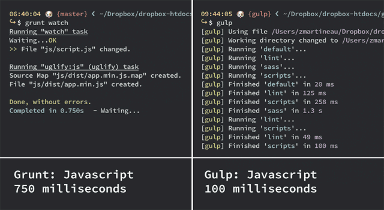

#Task Managers

##Grunt & Gulp

There are two main differences between Grunt and Gulp:

* The way you configure your tasks. Grunt is configuration-based. Gulp is stream-based.
* The way they run your tasks. Grunt runs the processes you want to execute in a sequential manner. Gulp tries to run them with maximum concurrency, meaning it will try to execute processes in parallel if possible.

Gulp’s syntax is terser. The great thing about Gulp is the stream-based build system. You just create your tasks by piping in all of your processes, one after another.  

Tasks created with Gulp result in a much shorter and cleaner task configuration file. In other words, with Gulp, there is less code to write for doing the same processes.

Besides the differences in syntax of both taskmanagers, the difference in speed is also noticable.

Zander Martineau made a speed comparison test of Grunt vs. Gulp. He similarly reports that Gulp was able to complete tasks quicker than Grunt:

###Winner: Gulp
Mostly because of the syntax i decided to use Gulp. As a beginner i think as a beginner it is easier to understand what is happening with Gulp rather than Grunt.

sources:  
[Grunt Vs Gulp](http://sixrevisions.com/web-development/grunt-vs-gulp/)  
[Speed testing Gulp & Grunt](http://tech.tmw.co.uk/2014/01/speedtesting-gulp-and-grunt/)

